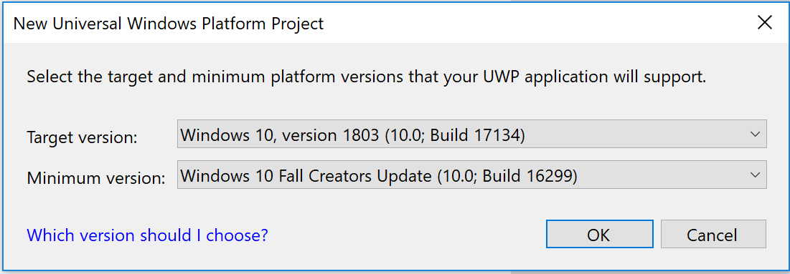
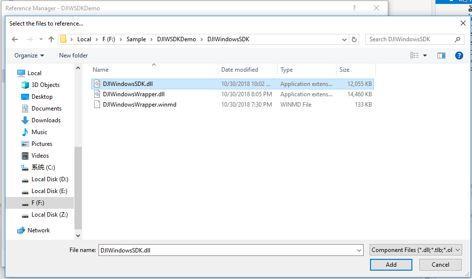
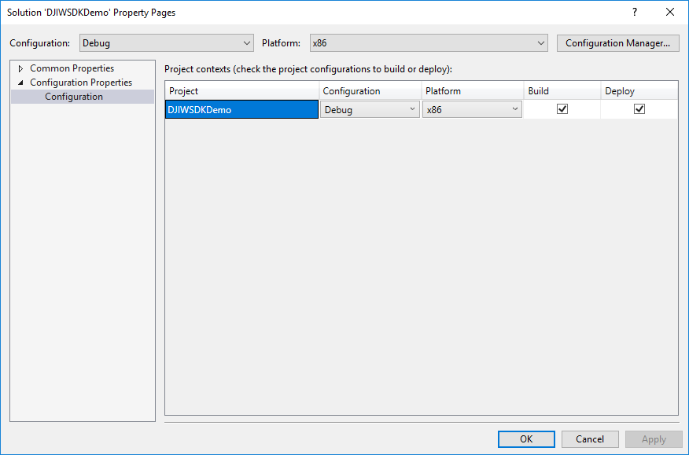

The examples below import the DJI Windows SDK into a new UWP project. The same steps can be used for integration into an existing application.

**Screenshots in this section are generated using Visual Studio 2017.**

## Create a New UWP Application

   * Open Visual Studio 2017.
   * Select **File->New->Project**.
   * Choose **Blank App(Universal Windows)** template.
   * Fill in the name column and choose the location of the project
   * Press **OK**.
   * "DJIWSDKDemo" will be used as the **Product Name**.
   * Choose the **Target version** and **Minimum version**
        
      

## Import WSDK into the Project

   * Firstly, create a folder named "DJIWindowsSDK", and copy DJI Windows SDK libraries into it.
   
   
   * Secondly, add references of DJI Windows SDK to your project. 
     * a. Right-click on DJIWSDKDemo project, and select **Add Reference**.
     * b. Select **Browse**, and select DJIWindowsSDK.dll. Click **Add**.
     * c. Click **OK**.
     
     
   * Thirdly, add dll of third parties to the project.
     * a. Copy dll of third parties(**pthread_dll.dll** and **libcrypto-1.1.dll**, for x86) to the root path of the project
     * b. Right-click on DJIWSDKDemo project, select **Add->Existing Item**, and click the dlls needed.
     
     

## Configuration Properties

   * Right-click on the **Solution 'DJIWSDKDemo'**, select **Properties**.
   * Make sure that the **Platform** configuration is suitable for DJI Windows SDK(x86 or x64).
   
   * Double-click on **Package.appxmanifest**, select **Packaging**, and fill in the **Package name** column with your application's package id. Here, we fill in the form with "com.dji.wsdkdemo".
   
   * Configurate serial port authority. Right-click on **Package,appxmanifest**, select **View Code**, add the following code inside **Capabilities**.

~~~csharp
<DeviceCapability Name="serialcommunication">
    <Device Id="vidpid:2ca3 001f">
        <Function Type="name:serialPort" />
    </Device>
</DeviceCapability>
~~~

## Register Application
 
   * Register your application with package id [here](https://developer.dji.com/user/apps/#all).
   * Double click on **MainPage.xaml.cs**.
   * Import namespace of DJI Windows SDK into **MainPage.xaml.cs**.

~~~csharp
using DJI.WindowsSDK;
~~~

   * Create a new method `Instance_SDKRegistrationEvent`.
   * Add `SDKRegistrationStateChanged` event listening with method `Instance_SDKRegistrationEvent `.
   * Invoke `RegisterApp` in `MainPage()` as shown below:

~~~csharp
public MainPage()
{
    this.InitializeComponent();
    DJISDKManager.Instance.SDKRegistrationStateChanged += Instance_SDKRegistrationEvent;
    //Replace app key with the real key registered. Make sure that the key is matched with your application's package id.
    DJISDKManager.Instance.RegisterApp("app key");
}

private void Instance_SDKRegistrationEvent(SDKRegistrationState state, SDKError resultCode)
{
    if (resultCode == SDKError.NO_ERROR)
    {
    	System.Diagnostics.Debug.WriteLine("Register app successfully.");
        DJISDKManager.Instance.ComponentManager.GetProductHandler(0).ProductTypeChanged += async delegate (object sender, ProductTypeMsg? value)
        {
            await Dispatcher.RunAsync(Windows.UI.Core.CoreDispatcherPriority.Normal, async () =>
            {
                if (value != null && value?.value != ProductType.NONE)
                {
                    System.Diagnostics.Debug.WriteLine("Aircraft is connected now.");
                    //You can load/display your pages relative to aircraft operations here.
                }
                else
                {
                    System.Diagnostics.Debug.WriteLine("Aircraft is disconnected now.");
                    //You can hide your pages relative to aircraft operations, or provide users with some aircraft connection tips here.
                }
            });
        };
        //You need to get the product's connection state after activating, if you have already connected the aircraft before activate Windows SDK.
        var productType = (await DJISDKManager.Instance.ComponentManager.GetProductHandler(0).GetProductTypeAsync()).value;
        if (productType != null && productType?.value != ProductType.NONE)
        {
            System.Diagnostics.Debug.WriteLine("Aircraft is connected now.");
            //You can load/display your pages relative to aircraft operations here.
        }
    }
    else
    {
        System.Diagnostics.Debug.WriteLine("SDK register failed, the error is: ");
        System.Diagnostics.Debug.WriteLine(resultCode.ToString());
    }
}

~~~

## Run WSDK Demo

As this application is only checking for registration and not interacting directly with a product, no product needs to be connected to the application for this to run. The application will need internet connectivity to perform registration successfully.

If the App Key was generated correctly and the windows 10 device has internet connectivity, then the following log should be seen in output window: **Register app succfully.**
