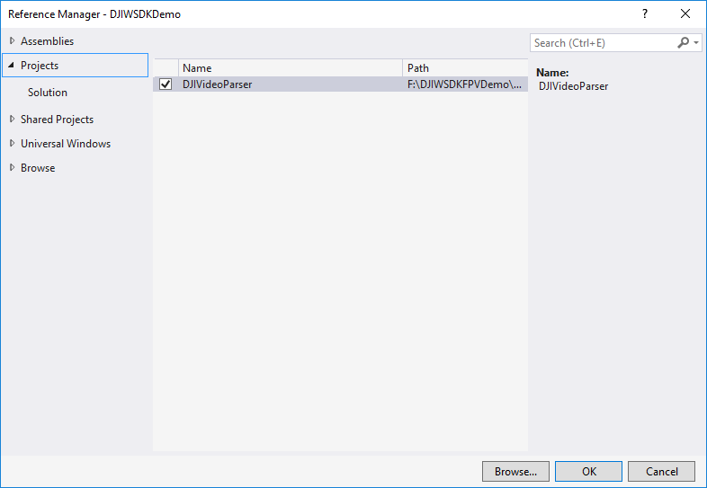
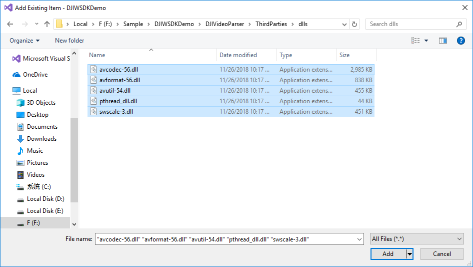
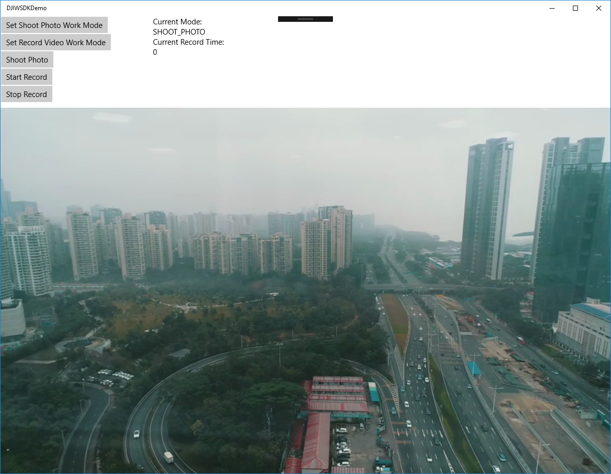

*If you come across any mistakes or bugs in this tutorial, please let us know using a Github issue, a post on the DJI forum. Please feel free to send us Github pull request and help us fix any issues.*

---

This tutorial is designed for you to gain a basic understanding of the DJI Windows SDK. It will implement the FPV view.

You can download the tutorial's final sample project from this [Github Page](https://github.com/DJI-Windows-SDK-Tutorials/Windows-FPVDemo).
   
We use Phantom 4 Pro V2.0 as an example to make this demo.

## Import DJIVideoParser Project

Based on the DJIWSDKDemo, now we start to import DJIVideoParser project.

* Firstly, copy DJIVideoParser project to root folder of DJIWSDKDemo. You can find DJIVideoParser project [here](https://github.com/dji-sdk/Windows-SDK/tree/master/Sample%20Code).

* Secondly, add DJIVideoParser project.
  * a. Open DJIWSDKDemo solution, right-click on the solution, select **Add->Existing Project**.
  * b. Locate to the folder where DJIVideoParser.vcxproj exists, select it and click **Open**.
* Thirdly, configurate DJIVideoParser project.
  * a. Right-click on the DJIVideoParser project, select **Properties**.
  * b. Pay attention to following points: **Configuration, Platform, Target Platform Version** and **Output Directory**.
  
* Fourthly, add reference to DJIWSDKDemo.
  * a. Right-click on DJIWSDKDemo project, and select **Add Reference**, and then click **Projects**.
  * b. Check the box before DJIVideoParser project.
  
  * Click **OK**.
* Finally, copy FFMpeg dlls to DJIWSDKDemo project.
  * a. Right-click on the DJIWSDKDemo project. Select **Add->Existing Item**.
  * b. Locate to dlls of FFMpeg(under the folder of /DJIVideoParser/ThirdParties/dlls).
  * c. Select all of them, and then click **Add**.
  

## Implementing the First Person View

  * **1**. Add FPV image view. Double-click on the **MainPage.xaml** to open it. We can see there is a **Grid** declaration. Add an **Image** element named "FPVImage" inside it.
  
  * **2**. Add video data parser and container. Double-click on the **MainPage.xaml.cs** to open it. Add the following elements inside MainPage.

~~~csharp
//use videoParser to decode raw data.
private DJIVideoParser.Parser videoParser;
//decoded data container
private byte[] decodedDataBuf;
//FPV image source
private WriteableBitmap VideoSource;
//multi-thread protect
private object bufLock = new object();
~~~
  * **3**. Add video raw data and decoded data callback. Add the following methods inside **Class MainPage**.

~~~csharp
//raw data
void OnVideoPush(VideoFeed sender, [ReadOnlyArray] ref byte[] bytes)
{
    videoParser.PushVideoData(0, 0, bytes, bytes.Length);
}

//decode data
async void ReceiveDecodedData(byte[] data, int width, int height)
{
    lock (bufLock)
    {
        if (decodedDataBuf == null)
        {
            decodedDataBuf = data;
        }
        else
        {
        	  if (data.Length != decodedDataBuf.Length)
            {
            		Arrat.Resize(ref decodedDataBuf, data.Length)
            }
            data.CopyTo(decodedDataBuf.AsBuffer());
        }
    }
    await Dispatcher.RunAsync(Windows.UI.Core.CoreDispatcherPriority.Normal, () =>
    {
        if (VideoSource == null || VideoSource.PixelWidth != width || VideoSource.PixelHeight != height)
        {
            VideoSource = new WriteableBitmap((int)width, (int)height);
            FPVImage.Source = VideoSource;
        }

        lock (bufLock)
        {
            decodedDataBuf.AsBuffer().CopyTo(VideoSource.PixelBuffer);
        }
        VideoSource.Invalidate();
    });
}
~~~
  * **4**. Add raw data and decoded data listener after registering app successfully.

~~~csharp
//listen video receive data
if (videoParser == null)
{
    videoParser = new DJIVideoParser.Parser();
    videoParser.Initialize();
    videoParser.SetVideoDataCallack(0, 0, ReceiveDecodedData);
    DJISDKManager.Instance.VideoFeeder.GetPrimaryVideoFeed(0).VideoDataUpdated += OnVideoPush;
}
~~~
  
## Enjoying the First Person View

Run the demo now and connect your PC to the Remote Controller of the aircraft. If you can see the live video stream in the application, congratulations!

  
  
  
## Shoot Photo And Record Video

### Camera Work Mode
Before we can shoot photo or record video, we need to know the work mode of camera. There are serval types of [camera work mode](https://developer.dji.com/api-reference/windows-api/Components/CameraHandler.html?search=camerawork&i=3&#value_cameraworkmode_inline). We can shoot photo and start record video when the camera work modes are **SHOOT_PHOTO** and **RECORD_VIDEO**, respectively.

### Display and Switch Camera Mode
* Display Camera Mode

  When we set a work mode to camera, we can add camera work mode change event to constantly display the current camera mode. We can add a TextBlock named "ModeTB" to display the camera work mode.

~~~csharp
DJISDKManager.Instance.ComponentManager.GetCameraHandler(0, 0).CameraWorkModeChanged += async delegate (object sender, CameraWorkModeMsg? value)
{
    await Dispatcher.RunAsync(Windows.UI.Core.CoreDispatcherPriority.Normal, async () =>
    {
         if (value != null)
         {
             ModeTB.Text = value.Value.value.ToString();
         }
    });
};
~~~

* Switch camera mode

  Before shooting photo or recording video, we need to switch camera mode to a proper work mode. Add a method named SetCameraWorkMode to implement camera mode switching, the implementation of the method is shown as following:
  
~~~csharp
private async void SetCameraWorkMode(CameraWorkMode mode)
{
    if (DJISDKManager.Instance.ComponentManager != null)
    {
        CameraWorkModeMsg workMode = new CameraWorkModeMsg
        {
            value = mode,
        };
        var retCode = await DJISDKManager.Instance.ComponentManager.GetCameraHandler(0, 0).SetCameraWorkModeAsync(workMode);
        if (retCode != SDKError.NO_ERROR)
        {
            OutputTB.Text = "Set camera work mode to " + mode.ToString() + "failed, result code is " + retCode.ToString();
        }
    }
    else
    {
        OutputTB.Text = "SDK hasn't been activated yet.";
    }
}
~~~

### Shoot Photo and Record Video
Before shooting photo or recording video, we need to switch the camera work mode to the proper mode.

* Shoot Photo
  
  Add a button named "StartShootPhoto", and implement the click method of it as shown below:
  
~~~csharp
private async void StartRecordVideo_Click(object sender, RoutedEventArgs e)
{
    if (DJISDKManager.Instance.ComponentManager != null)
    {
        var retCode = await DJISDKManager.Instance.ComponentManager.GetCameraHandler(0, 0).StartRecordAsync();
        if (retCode != SDKError.NO_ERROR)
        {
            OutputTB.Text = "Failed to record video, result code is " + retCode.ToString();
        }
        else
        {
            OutputTB.Text = "Record video successfully";
        }
    }
    else
    {
        OutputTB.Text = "SDK hasn't been activated yet.";
    }
}
~~~

* Listen Video Record Time
	
	  When we record video, we need to know the record time of video. The following code can help you the get the record time constantly.
	   
~~~csharp
//listen video record time
DJISDKManager.Instance.ComponentManager.GetCameraHandler(0, 0).RecordingTimeChanged += async delegate (object sender, IntMsg? value)
{
    await Dispatcher.RunAsync(Windows.UI.Core.CoreDispatcherPriority.Normal, async () =>
                              {
                                  if (value != null)
                                  {
                                      RecordTimeTB.Text = value.Value.value.ToString();
                                  }
                              });
};
~~~

* Record Video
   	 
   	 Add a button named "StartRecordVideo", and implement the click method of it as shown below:
   	 
~~~csharp
private async void StartRecordVideo_Click(object sender, RoutedEventArgs e)
{
    if (DJISDKManager.Instance.ComponentManager != null)
    {
        var retCode = await DJISDKManager.Instance.ComponentManager.GetCameraHandler(0, 0).StartRecordAsync();
        if (retCode != SDKError.NO_ERROR)
        {
            OutputTB.Text = "Failed to record video, result code is " + retCode.ToString();
        }
        else
        {
            OutputTB.Text = "Record video successfully";
        }
    }
    else
    {
        OutputTB.Text = "SDK hasn't been activated yet.";
    }
}
~~~   	 

* Display Result

## Summary
   
   In this tutorial, you’ve learned how to use DJI Windows SDK to show the FPV View from the aircraft's camera and control. These are the most basic and common features in a typical drone app. However, if you want to create a drone app which is more fancy, you still have a long way to go. More advanced features should be implemented, including previewing the photo and video in the SD Card, showing the OSD data of the aircraft and so on. Hope you enjoy this tutorial, and stay tuned for our next one!
   
